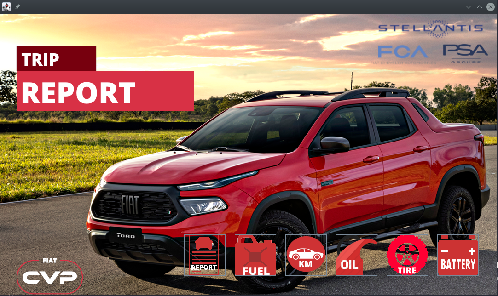
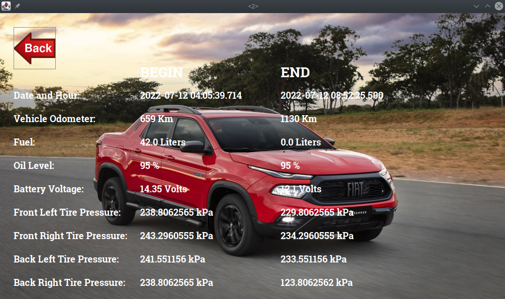
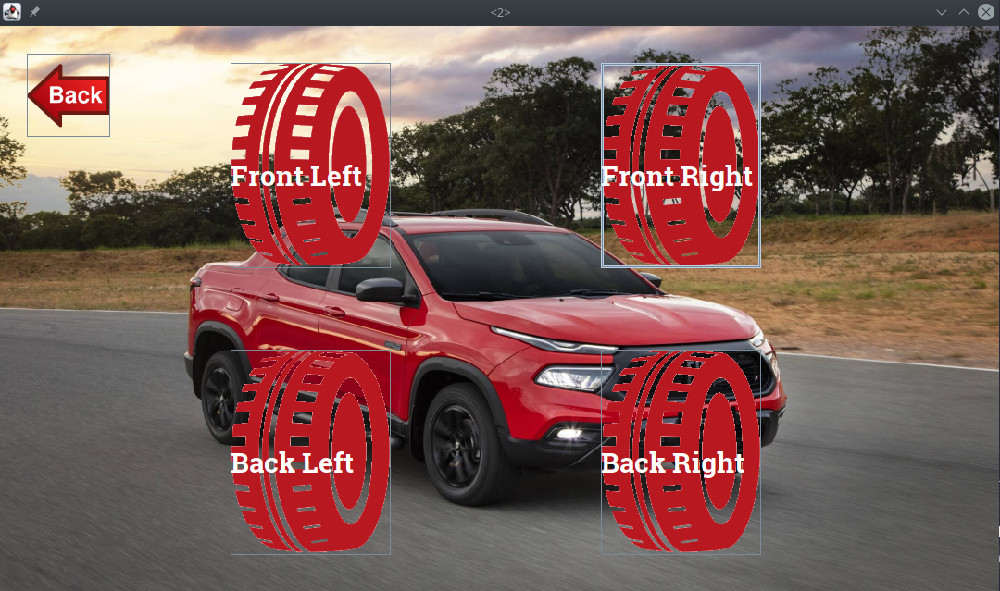
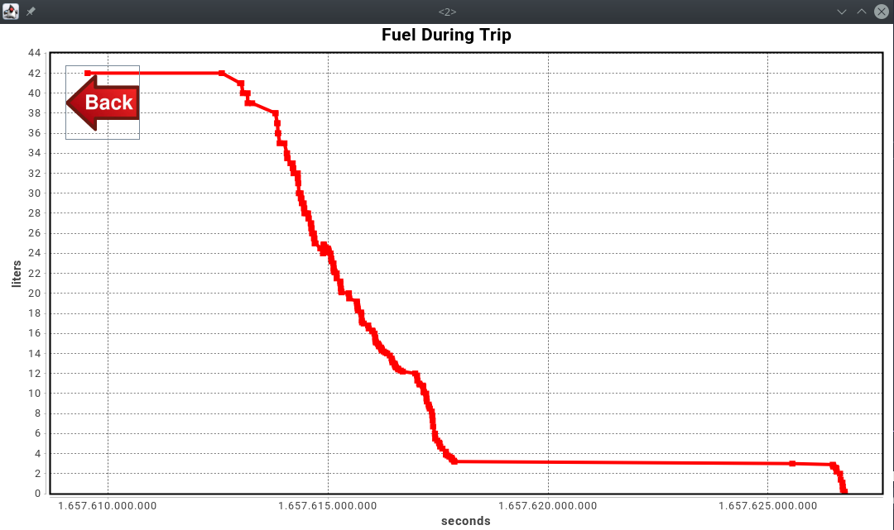

# Desafio Connect Stellantis 2022

## Projeto Car Trip Report
Uma prova de conceito, de código fonte aberto, que foi implementada utilizando a linguagem Java e combinação de bibliotecas opencsv,
jcommon, jfreechar e swing. Tem por objetivo analisar os dados sensoriais dos véiculos conectados e gerar um relatório de viagem,
proporcionando ao passageiro controle total sobre tudo o que ocorreu no veículo durante a viagem, como oscilação da pressão dos pneus,
tensão da bateria, nível de óleo do motor, marcador de kilometragem, quantidade de combustível entre outros.

<p align="center">
  
</p>

## Considerações Iniciais
Algumas considerações foram realizadas para poder elaborar a solução realizada neste projeto. Estas considerações envolvem fatores
externos que não poderiam ser implementados neste projeto, pois trata-se da tecnologia da Stellantis que atualmente já existe.
- Os dados de nível de óleo do motor estavam vazios, portanto houve um enriquecimento desse dado para demonstração do solução.
- Os dados de pressão dos pneus, kilometragem percorrida e combústivel utilizado foram enriquecidos para melhor demonstração da solução.
- Foi considerado que é possível obter os dados de GCD de forma contínua durante uma viagem.
- Um dos requisitos do desafio era a utilização do conceito de orientação a objetos, portanto escolheu-se a linguagem Java para a solução.
- A solução foi desenvolvida utilizando o sistema operacional Linux.
- A documentação exigida pelo desafio foi elaborada utilizando sintaxe markdown, para facilitar a leitura pelo próprio github.

## Como Executar

Para executar o software é necessário que se tenha instalado a máquina virtual Java (openjdk >= 1.8) no sistema operacional.
Dentro do repositório, no diretório raíz, executar:

```
java -cp src/libs/app.jar connect.stellantis.car.trip.report.App
```

## Funcionamento

O sistema funciona realizando a leitura de dados sensoriais de uma viagem realizada por um veículo. Esses dados ficam em um arquivo com extensão csv.
Esse arquivo possui dados, em função do tempo, lidos dos sensores contidos no veículo durante a viagem do mesmo.
Os seguintes dados são utilizados pelo sistema:
- Distância percorrida reportada pelo odômetro.
- Nível de óleo no motor.
- Tensão na bateria.
- Pressão nos pneus.
- Quantidade de combustível no tanque.

## Arquitetura do Sistema

O sistema foi dividido em 2 subsistemas, como mostrado abaixo:

### Subsistema de controle e leitura de dados

O subsistema de controle e leitura de dados, também conhecido como BACKEND da aplicação, possui as seguintes classes:

- **CarTripData:** responsável por realizar a leitura dos dados do arquivo csv e preencher os objetos específicos com os dados lidos.
- **CarTripConstants:** como se trata de uma demo, foram utilizadas constantes para o arquivo de dados e para as imagens da gui.
- **CarTripBatteryVoltageData:** classe que representa um valor de tensão da bateria em um deteminado tempo.
- **CarTripBatteryVoltage:** classe que representa todos os dados de tensão da bateria obtidos na viagem.
- **CarTripDateHourData:** classe que representa um valor de data e hora em um deteminado "epoch".
- **CarTripDateHour:** classe que representa todos os dados de data e hora obtidos na viagem.
- **CarTripFuelData:** classe que representa um valor de combustível no tanque em um deteminado tempo.
- **CarTripFuel:** classe que representa todos os dados de combustível no tanque obtidos na viagem.
- **CarTripOdometerData:** classe que representa um valor de kilometragem total percorrida pelo veículo em um deteminado tempo.
- **CarTripOdometer:** classe que representa todos os dados de kilometragem total percorrida pelo veículo obtidos na viagem.
- **CarTripOilLevelData:** classe que representa um valor de nível de óleo no motor em um deteminado tempo.
- **CarTripOilLevel:** classe que representa todos os dados de nível de óleo no motor obtidos na viagem.
- **CarTripTirePressureData:** classe que representa um valor de pressão no pneu em um deteminado tempo.
- **CarTripTirePressure:** classe que representa todos os dados de pressão no pneu obtidos na viagem.

### GUI - Interface gráfica com o usuário

O subsistema GUI, também conhecido como FRONTEND da aplicação, possui as seguintes classes:

- **CarTripManager:** responsável por gerenciar as mudanças de tela, eventos de botão e inicialização da GUI.
- **MainScreen:** classe que representa a tela inicial e principal da aplicação, possui botões para interação com o usuário.
- **ReportScreen:** classe que repesenta a tela que exibe o relatório da viagem, mostrando dados do começo da viagem e dados do final da viagem.
- **ChartScreen:** classe que repesenta a tela que exibe um gráfico cartesiano de variação dos dados sensoriais pelo tempo da viagem.
- **TireSelectionScreen:** classe que repsenta a tela de seleção de qual pneu o usuário deseja ver os dados em formato cartesiano.

## Funcionalidades

O sistema ainda é uma demonstração de conceito, portanto, não apresenta todas as funcionalidades desejáveis.
As funcionalidades abaixo são as já implementadas na solução.
- Leitura de dados brutos de viagem.
- Exibição de relatório de viagem contendo informações do começo da viagem e do final da viagem, para se poder realizar comparações.
- Exibição em gráfico cartesiano da distância pecorrida com relação ao tempo da viagem.
- Exibição em gráfico cartesiano do nível de óleo no motor com relação ao tempo da viagem.
- Exibição em gráfico cartesiano da tensão na bateria com relação ao tempo da viagem.
- Exibição em gráfico cartesiano da pressão nos quatro pneus com relação ao tempo da viagem.
- Exibição em gráfico cartesiano da quantidade de combústivel no tanque com relação ao tempo da viagem.
- Cálculo de consumo do véiculo e exportação dos dados por bluetooth, wifi, para o celular.
- Adição de dados de marcha atual do câmbio, para então realizar gráficos de consumo por marcha.

## Atuais Telas da Solução

### Tela Principal

A tela principal é apresentada na inicialização do sistema. Ela contém os botões para interação do usuário.
<p align="center">
  
</p>

### Tela De Relatório

A tela de relatório exibe informações básicas dos dados de começo e fim de viagem.
<p align="center">
  
</p>

### Tela De Seleção de Pneus

A tela de seleção de pneus exibe as opções de escolha dos 4 pneus para visualização do gráfico de pressão dos mesmos.
<p align="center">
  
</p>

### Tela De Exibição Cartesiana

A tela de exibição cartesiana mostra ao usuário um gráfico cartesiano das medidas sensoriais do veículo com relação ao tempo da viagem.
<p align="center">
  
</p>

## Próximos Passos

Várias ideias foram surgindo ao decorrer do projeto e não foram possíveis ainda de serem implementadas por limitação de tempo.
As ideias abaixo são os próximos passos para a evolução da solução apresentada por esse projeto.
- Cálculo da quantidade de kilômetros percorridos na viagem e exibição no relatório de viagem.
- Cálculo da quantidade de combústivel utilizado na viagem e exibição no relatório de viagem.
- Cálculo do preço da viagem utilizando os dados de combústivel utilizado e distância percorrida.
- Divisão do preço da viagem por passageiros no carro, facilitando rateamento de despesas.
- Verificação automática, através de inteligência artificial, de problemas com nível do óleo.
- Verificação automática, através de inteligência artificial, de pneu furado.
- Verificação automática, utilizando dados de posição e dados de distância percorrida, de velocidade excedida no trecho.
- Verificação automática, através de inteligência artificial, de problemas de rendimento no consumo de combústivel.

## Quer contribuir?

No momento o projeto ainda encontra-se privado pois se trato de uma solução para um desafio proposto pela empresa Stellantis.

Apesar disso, trata-se de um projeto de código aberto e qualquer contribuição será super bem vinda no futuro próximo.

As tarefas estão visíveis na sessão **_Issues_** deste repositório e outras ainda estarão sendo adicionadas. Para quem deseja contribuir, basta escolher uma tarefa e realizar o **_FORK_** do projeto e, então, mão na massa!

Estamos abertos para tirar qualquer dúvida :).
